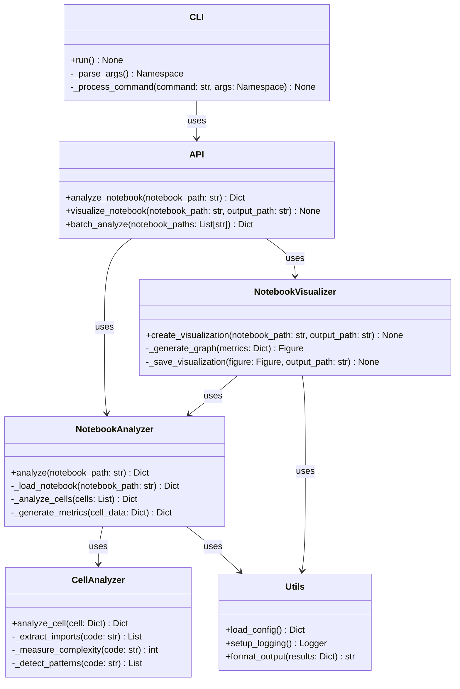

# Class Diagram

The following diagram illustrates the class structure and relationships in Octotools.

## Component Relationships

The diagram above illustrates the key classes and their relationships:

1. **NotebookAnalyzer** - Core class responsible for analyzing Jupyter notebooks
2. **CellAnalyzer** - Analyzes individual cells within a notebook
3. **NotebookVisualizer** - Creates visualizations based on notebook analysis
4. **CLI** - Command-line interface for the tool
5. **API** - Programmatic interface for the tool
6. **Utils** - Utility functions used by multiple components

## Key Relationships

- **NotebookAnalyzer** uses **CellAnalyzer** to analyze individual cells
- **NotebookVisualizer** uses **NotebookAnalyzer** to get data for visualizations
- **API** uses both **NotebookAnalyzer** and **NotebookVisualizer**
- **CLI** uses the **API** to provide command-line functionality
- **Utils** provides common functionality to several components

## Design Patterns

The codebase leverages several design patterns:

1. **Facade Pattern** - The API class provides a simplified interface to the complex subsystem
2. **Strategy Pattern** - Different analysis strategies can be used by the NotebookAnalyzer
3. **Command Pattern** - The CLI uses commands to trigger different functionalities
4. **Singleton Pattern** - The Utils class provides global access to configuration
5. **Composite Pattern** - Notebooks and cells form a composite structure
</rewritten_file> 