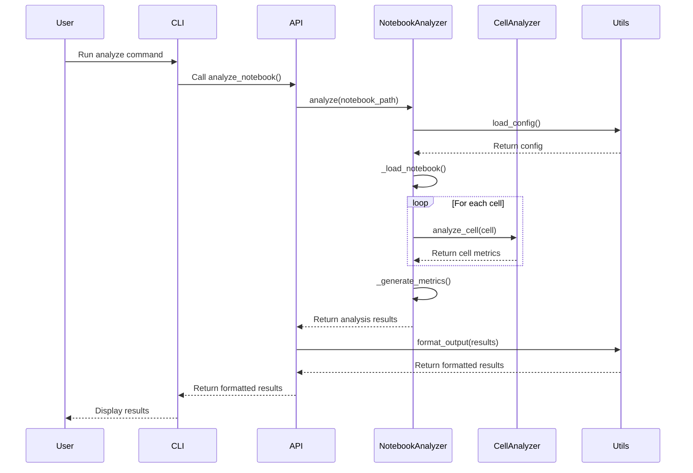
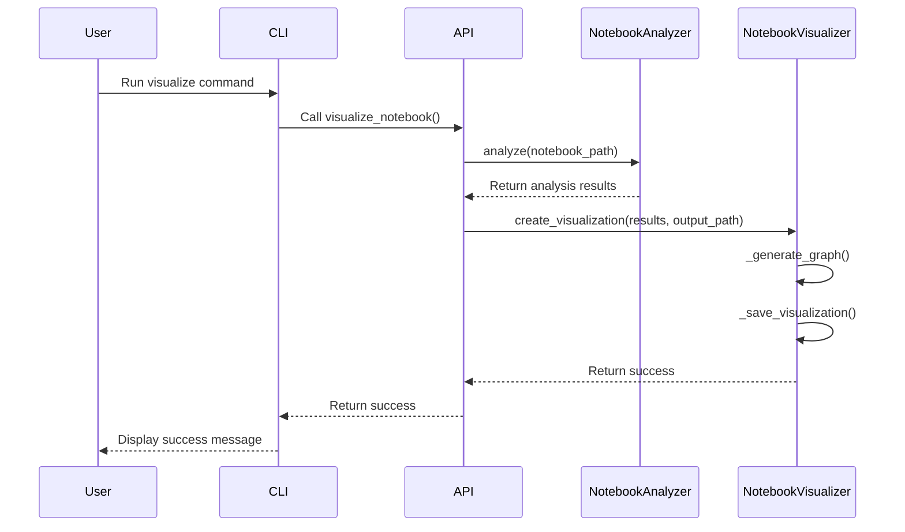
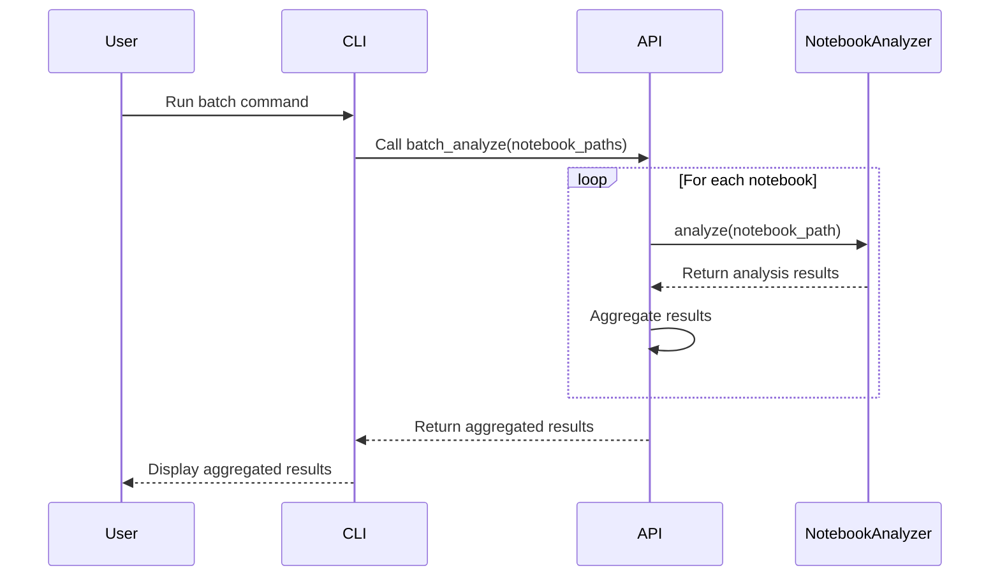
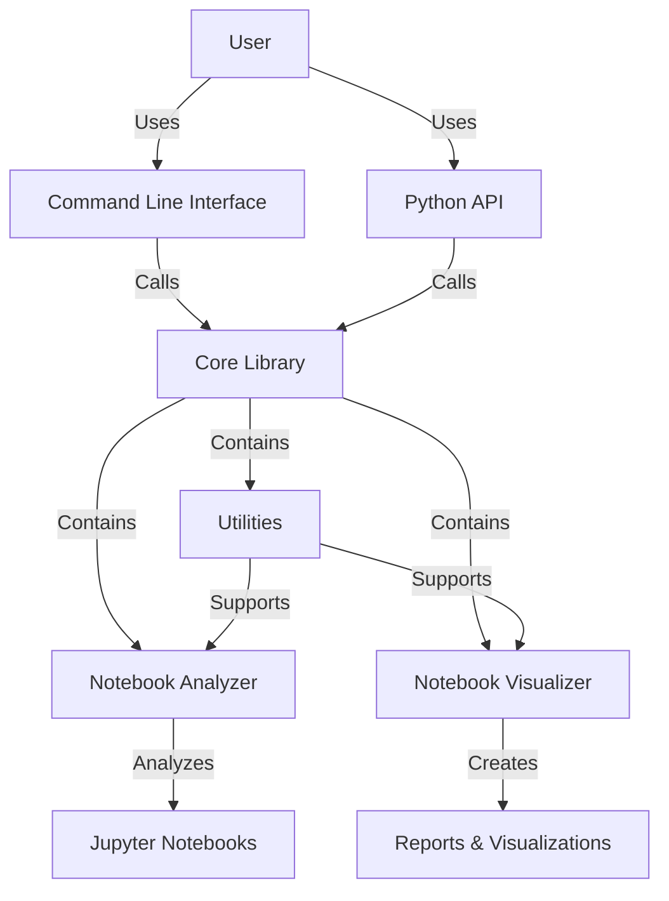

# Process Flow Diagrams

This document contains flow diagrams illustrating the key processes in Octotools.

## Notebook Analysis Flow

The following diagram shows the process flow for analyzing a notebook.

## Visualization Flow

The following diagram shows the process flow for creating visualizations.

## Batch Analysis Flow

The following diagram shows the process flow for batch analysis of multiple notebooks.

## Overall System Architecture

The following diagram shows the overall system architecture.

